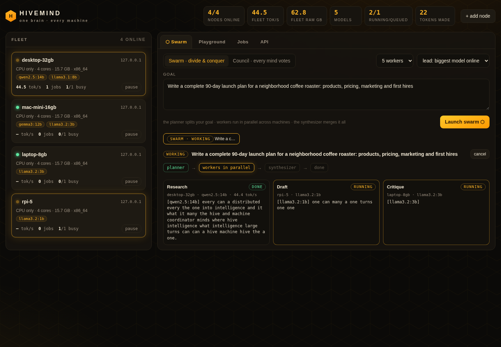

# ⬡ HIVEMIND

**one brain, every machine.**



HIVEMIND turns every computer you own into a single AI supercomputer: desktops, mac minis, gaming PCs, raspberry pis, that dusty old laptop in the closet. Add as many machines as you want, whenever you want. Each machine runs a tiny agent next to its local [Ollama](https://ollama.com). A coordinator fuses them into:

- **one OpenAI-compatible endpoint** (`/v1/chat/completions`). Point Open WebUI, Continue, aider, LangChain, or your own scripts at it and your whole house answers.
- **Swarm mode.** The biggest model online plans your goal into parallel subtasks, every machine works a piece at the same time, then the big model synthesizes one answer.
- **Council mode.** Every machine answers the same question with its own model, and a judge merges the best of all of them and flags where they disagreed.
- **a live dashboard** showing the fleet, tokens streaming out of every worker in real time, the swarm pipeline, a chat playground, and job history.
- **locked down for use from anywhere**: password + 2FA, device sessions you can revoke, QR pairing for your phone, and a WireGuard helper so the hive never has to sit on the open internet. See [docs/remote-access.md](docs/remote-access.md).

It needs no cloud, no API bills, and no port forwarding. Nodes only make **outbound** requests, so a machine at a friend's place or the office can join over a cloudflare tunnel.

```
          ┌──────────────── coordinator (flask + sqlite) ─────────────────┐
 you ───▶ │  dashboard  ·  /v1 openai api  ·  swarm engine  ·  job queue  │
          └──────▲──────────────▲──────────────▲──────────────▲───────────┘
                 │ pull         │ pull         │ pull         │ pull
          desktop-32gb     mac-mini-16gb   laptop-8gb       rpi-5
          qwen2.5:14b      gemma3:12b      llama3.2:3b      llama3.2:1b
            ollama           ollama          ollama           ollama
```

## quickstart

**1. coordinator** (any always-on machine; a raspberry pi or small desktop is perfect)

```bash
pip install -r requirements.txt
python3 coordinator/app.py
```

On first run it prints a **setup token**. Open `http://<that-machine>:7777/setup`, paste it, pick a password, and scan the 2FA QR with any authenticator app. The **node key** machines use to join is saved in `coordinator/hive_key.txt`, and the dashboard shows it under **+ add node**.

**2. nodes** (every machine that can run a model)

```bash
curl -fsSL https://ollama.com/install.sh | sh     # mac: download the app from ollama.com
ollama pull llama3.2                               # pick models that fit the machine (see below)

curl -fsSL http://<coordinator>:7777/node.py -o hive_node.py
python3 hive_node.py --hive http://<coordinator>:7777 --key <hive-key>
```

The node agent is **pure python stdlib**, so there's nothing to pip install. It auto-detects cpu/ram/gpu (apple silicon, nvidia, jetson, pi) and reports every model Ollama has. The dashboard's **+ add node** button gives you the exact copy-paste command.

### what to run where

| memory (ram, or vram on a gpu) | good models | flags |
|---|---|---|
| 32 GB+ (desktop, gpu box, apple silicon) | `qwen2.5:14b`, `gemma3:12b`, `qwen2.5-coder:14b` | `--slots 2` |
| 16-24 GB | `llama3.1:8b`, `qwen2.5:7b`, `gemma3:12b` | |
| 8 GB (raspberry pi 5, jetson, older laptops) | `llama3.2:3b`, `qwen2.5:3b` | |
| 4 GB | `llama3.2:1b`, `qwen2.5:0.5b` | |

Put the biggest model on the biggest machine. The coordinator automatically gives the planner, synthesizer, and judge roles to the **largest model online**, and small machines chew through parallel subtasks.

## try it with zero models

A fake Ollama ships in `tools/` so you can watch the whole thing work before installing anything:

```bash
HIVE_KEY=demo python3 coordinator/app.py &
python3 tools/mock_ollama.py --port 11500 --models qwen2.5:14b --tps 40 &
python3 tools/mock_ollama.py --port 11501 --models llama3.2:3b --tps 25 &
python3 node/hive_node.py --key demo --name big --ollama http://127.0.0.1:11500 &
python3 node/hive_node.py --key demo --name small --ollama http://127.0.0.1:11501 &
open "http://127.0.0.1:7777/setup"   # setup token is printed by the coordinator
```

## the api

Base url `http://<coordinator>:7777/v1`, api key = your hive key.

| model | what happens |
|---|---|
| `auto` | the first free node runs it on its default (biggest) model |
| `llama3.2`, `qwen2.5:14b`, … | routed to a node that has that model (a bare name matches any tag) |
| `hive-swarm` | planner → parallel workers on different machines → synthesizer |
| `hive-council` | every node answers → judge merges |

```bash
curl http://localhost:7777/v1/chat/completions \
  -H "Authorization: Bearer $HIVE_KEY" -H "Content-Type: application/json" \
  -d '{"model":"hive-council","messages":[{"role":"user","content":"best way to learn assembly?"}]}'
```

```python
from openai import OpenAI
hive = OpenAI(base_url="http://localhost:7777/v1", api_key="hive-...")
print(hive.chat.completions.create(model="hive-swarm",
      messages=[{"role": "user", "content": "write a full business plan for a small IT consulting company"}]
     ).choices[0].message.content)
```

Streaming (`"stream": true`) works for everything. For swarm and council, pipeline status comes through as `reasoning_content`, so clients that show reasoning get a live view of the hive thinking.

## using it from your phone, anywhere

```bash
python3 tools/wireguard_setup.py --endpoint <your-public-ip-or-ddns> --peers phone
```

That makes a private WireGuard network with a QR code for the free WireGuard phone app. Your phone reaches the hive at `10.44.0.1`, and nothing else on the internet can even see it. Then open 🔒 security → **show pairing qr** on the dashboard and scan it with your phone to sign in. The full walkthrough, including the no-port-forwarding and cloudflare options, is in [docs/remote-access.md](docs/remote-access.md).

The node key (`coordinator/hive_key.txt`) is a password for machines. Rotate it by deleting the file (or changing `HIVE_KEY`) and restarting.

## how it holds up

- **Nodes die, work doesn't.** A node that misses heartbeats for 20s is marked offline and its running jobs go back in the queue for another machine, up to 3 attempts. The smoke test literally kills a node mid-generation.
- **The coordinator dies, work doesn't.** On restart, running jobs are requeued.
- **Pause and resume** any node from the dashboard. It finishes its current job and stops taking new ones.
- **Reasoning models** (qwen3, deepseek-r1) are handled: thinking is streamed live to the dashboard but kept out of final answers.
- **SQLite in WAL mode** with serialized writes. One file, zero ops, back it up by copying it.

## config

| env | default | |
|---|---|---|
| `HIVE_KEY` | auto-generated | shared secret for nodes, dashboard, api |
| `HIVE_PORT` / `HIVE_HOST` | `7777` / `0.0.0.0` | |
| `HIVE_DB` | `coordinator/hivemind.db` | |
| `HIVE_NODE_TIMEOUT` | `20` | seconds of silence before a node is offline |
| `HIVE_JOB_TIMEOUT` | `900` | max seconds a caller waits on a job |

Node flags: `--name`, `--slots N`, `--default-model`, `--models a,b` (only share these), `--ollama URL`. All of them can also be set via env (`HIVE_URL`, `HIVE_KEY`, `HIVE_SLOTS`, …).

`pip install waitress` and the coordinator uses it automatically for better concurrency.

## tests

```bash
python3 tools/smoke_test.py      # the fleet, end to end
python3 tools/auth_test.py       # login, 2fa, csrf, lockout, pairing, sessions
```

The smoke test boots a coordinator, mock ollamas, and nodes, then checks auth, model routing, streaming, swarm (including that the planner lands on the biggest model), council, the virtual models over the openai api, and a node dying mid-job.

## layout

```
coordinator/app.py            flask app: fleet, queue, swarm engine, openai api, reaper
coordinator/auth.py           password + 2fa, sessions, csrf, lockout, qr pairing
coordinator/templates/        the dashboard and login screens (no build step)
node/hive_node.py             the node agent (stdlib only)
tools/mock_ollama.py          fake ollama for demos/tests
tools/smoke_test.py           end-to-end fleet test
tools/auth_test.py            auth test
tools/wireguard_setup.py      private wireguard network + phone qr codes
docs/remote-access.md         using the hive from anywhere, safely
```

## where this goes next

- **tool-using swarms**: workers get a sandboxed python/shell so subtasks can actually run code, and a critic loop checks results
- **smarter routing**: send each subtask to the node whose model is best at it (coder models get code, fast small models get summaries)
- **RAG across the fleet**: each node indexes its own local files and the hive searches all of them
- **mobile nodes**: a pi with a camera feeding vision jobs to a gpu box
