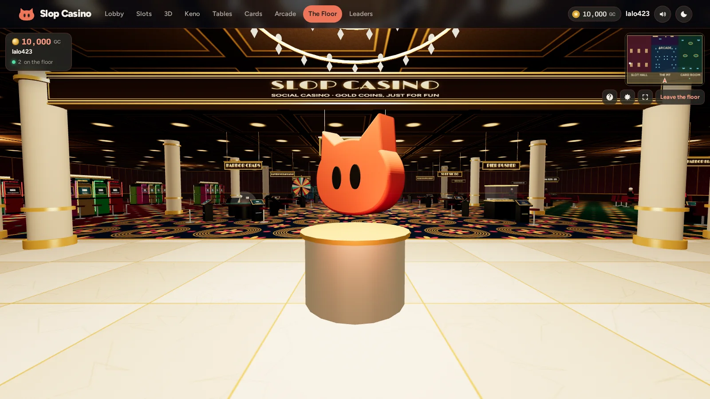
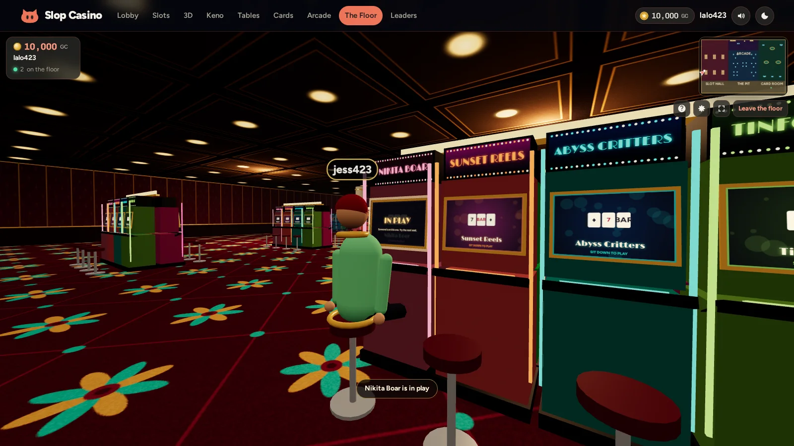
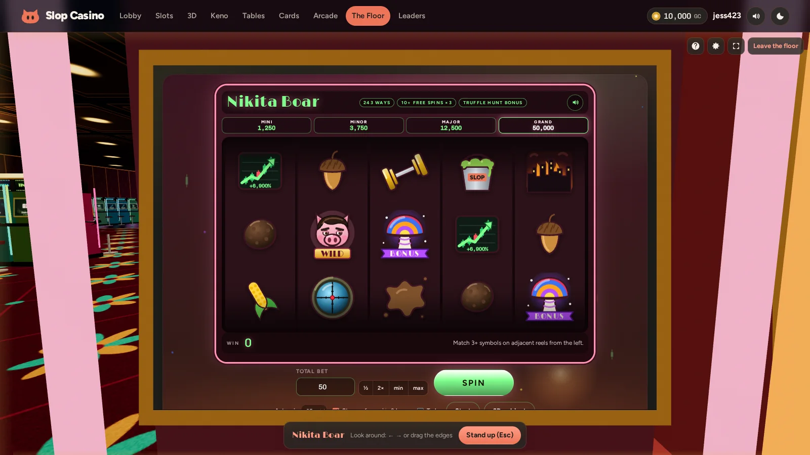
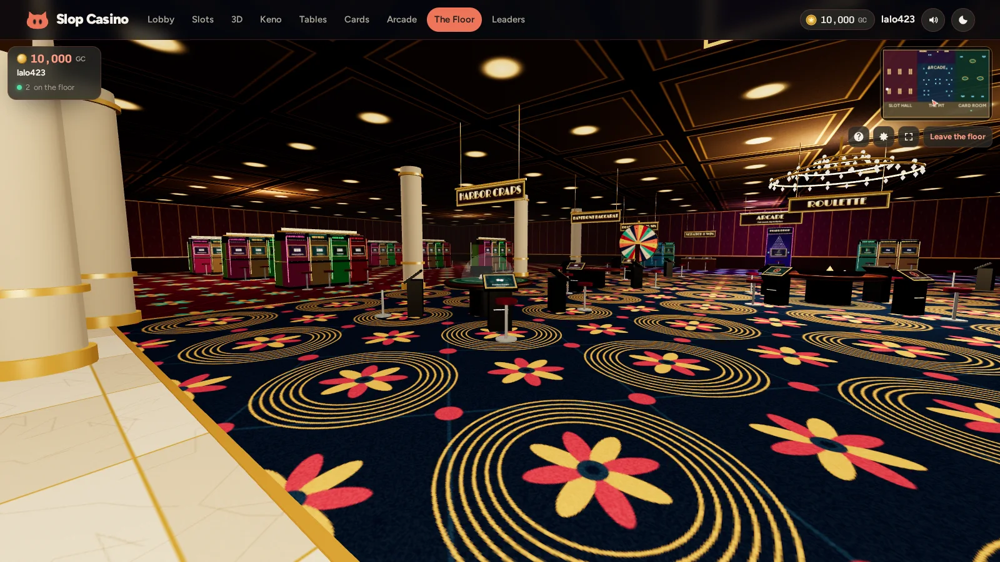
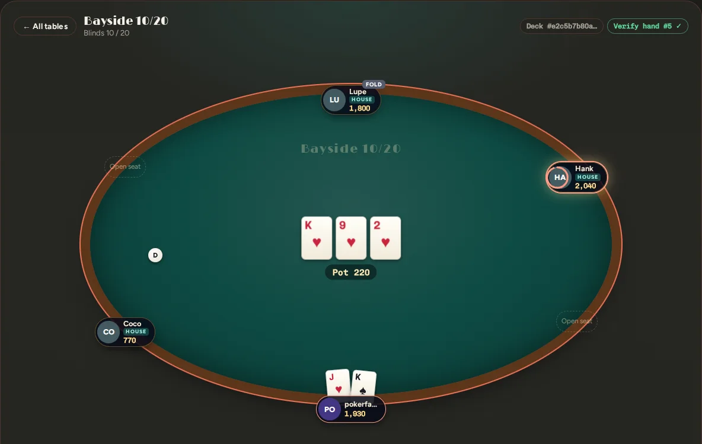
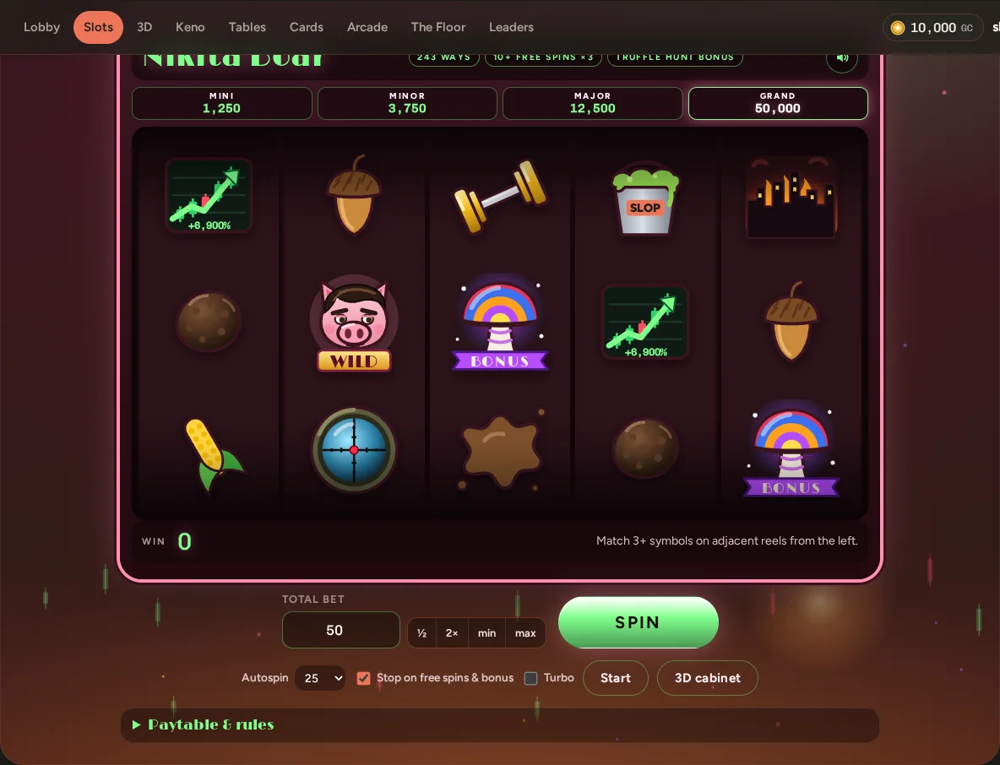
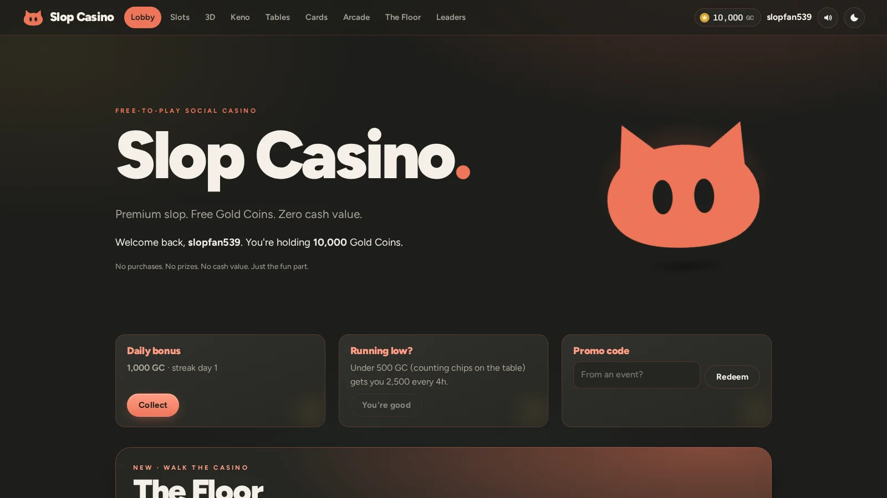

<p align="center"></p>

<h1 align="center">Slop Casino</h1>

<p align="center"><b>Premium slop. Free Gold Coins. Zero cash value.</b><br>
A walk-around 3D casino, 27 games and live multiplayer hold'em, in one PHP file.</p>



Slop Casino is a free-to-play social casino. Everything is played with **Gold Coins**: play money that can't be bought, sold, redeemed or traded. Walk the floor in first person, sit down at any machine or table and play the real game on its screen, run into other players, and take a seat at a live poker table. It's built so a casino partner can hand it to guests as a practice floor, a marketing hook or an event activation without touching real-money gaming.

It's one `index.php` plus a SQLite database that builds itself on first run, and an optional `ws.php` realtime server for multiplayer. No composer, no npm, no build step, no CDNs: three.js and the fonts are embedded.

## Quick start

```bash
git clone https://github.com/lalomorales22/slop-casino.git
cd slop-casino
php -S localhost:8000 index.php   # the site: every game works with just this
php ws.php                        # second terminal, optional: multiplayer floor + live poker (port 8081)
```

Open <http://localhost:8000>, grab your free coins, and hit **The Floor** in the nav. Needs PHP 8.1+ with `pdo_sqlite`. The first load creates `data/app.sqlite` and an `admin_password.txt` for the back office at `?action=admin`.

## A look around

| | |
|---|---|
|  |  |
| **Other players** walk the floor as avatars, with names over their heads. Their machine shows IN PLAY. | **Sit down** and the machine's screen becomes the real game, with the casino still around you. |
|  |  |
| **The Pit**: every table game has its own island with a real centerpiece. | **Bayside Hold'em**: live no-limit poker, with house players to keep tables dealing. |
|  |  |
| **Nikita Boar**, the first Slop character slot. | **The lobby**, in slop.cc colors. |

## The Floor

A first-person casino built entirely in code, about 70 × 45 m:

- **The rooms:**
  - A marble entrance lobby where the Slop mascot floats under the big sign.
  - A bar, and a cashier cage for free coins.
  - **The Slot Hall:** 48 cabinets, six of every slot.
  - **The Pit:**
    - Roulette has a real spinning wheel, and craps has a glass bubble dome.
    - The big six wheel, a sic bo cup, a crab track and the coin pusher round it out.
  - **The Card Room**, with an oval table for every live poker game.
  - **The Arcade**, with Pearl Drop as a tall showpiece.
- **Walk up and sit down.**
  - Controls: WASD + mouse to walk and look, Shift to run, E to play, Esc to stand.
  - The camera eases into the seat and the real game page loads on the machine's screen.
  - You can turn your head to look at the machines on either side while you play.
  - Every enabled game has at least one station.
- **Multiplayer.** Everyone online shows up as an avatar:
  - Positions are smoothed.
  - Chat appears over heads and in a chat panel (Enter to talk).
  - Other players' seated poses are visible, including at the poker tables.
- **Poker in 3D.** The cards, chip stacks, bets, pot and dealer button are drawn on the felt, with the betting bar at the bottom.
- **Phones too.** A virtual joystick, drag to look, tap a machine to walk over and sit.
- **Graceful.**
  - Without `ws.php` the floor still plays solo.
  - Without WebGL it lists every game as a link.
- **Bring your own building.**
  - Export a room from Blender as binary glTF and drop it at `data/floor.glb`. The spec: meters, y-up, origin at the entrance doors, hall toward −z, x −35..35, z 0..−45, 5 m ceiling.
  - It replaces the procedural walls, floor and ceiling. The machines, tables and collisions stay.

## Live hold'em

Real no-limit Texas hold'em between players, hosted by `ws.php`. Three tables run from 10/20 to 250/500.

- **Live-room rules:**
  - A moving button. Heads-up, the button posts the small blind.
  - The minimum raise is the last full raise, and a short all-in doesn't reopen the action (TDA rule).
  - Uncalled bets are returned, and side pots are exact.
  - A missed-blind rule, and an action clock.
- **Provably fair deal.** Before a card moves, the table publishes a SHA-256 of the shuffled deck plus a salt. After the hand it reveals both, and every hand history re-checks them in your browser.
- **Hidden cards stay hidden.** Each player is sent only their own view of the table. Tests scan every frame for cards the receiver shouldn't see.
- **Coins are safe.** If the server dies mid-hand, the next start refunds every seat its start-of-hand stack. A kill -9 test checks it to the coin.

## The games

| room | games |
|---|---|
| **Slot Hall** | **Nikita Boar** ★, Sunset Reels, Abyss Critters, Tinfoil Hat, Black Site Breach, Code Rain, Tiki Tides, Calavera Fiesta. 243 ways, wilds, free spins, and pick or wheel bonuses with Mini / Minor / Major / Grand jackpots. Every themed slot flips into a 3D cabinet. |
| **3D Games** | Coronado Roulette 3D, Harbor Craps (full bubble craps: every line, odds, place/buy/lay and prop bet), Pier Pusher |
| **Scratch & Keno** | Sunset Scratchers, Kelp Keno |
| **Table Games** | Coronado Roulette, Bayfront Baccarat, Surf Sic Bo (50 bets), Boardwalk Big Six, Crab Crawl Derby |
| **Card Room** | Harbor Blackjack (split, double, surrender), Boardwalk Poker (9/6 Jacks or Better), Coastline 3-Card, Bayside Hold'em (live), Tide Hi-Lo |
| **Boardwalk Arcade** | **Pearl Drop** ★ (provably fair plinko with golden pegs), Tide Crash, Reef Mines, Lighthouse Dice |

Every game's return was checked with exact math or simulation:
- The slots sit at 95.0–95.6%.
- The tables and arcade games run 97–99.6%.
- Exceptions: the carnival big six is lower (78–89%), and so are the scratchers (91%).

The full table with every figure, plus how each paytable was solved, is in [`docs/GAMES.md`](docs/GAMES.md).

### Character slots

Slop characters get their own machines. **Nikita Boar**, "the boar that broke the internet", is the first:
- **Wild:** the boar.
- **Bonus symbol:** a cosmic shroom.
- **Other symbols:** stonks charts, sniper scopes, gold dumbbells, kaiju skylines, truffles and a SLOP bucket.
- **Features:** free spins at 3×, and a Truffle Hunt pick bonus where you choose 3 of 12 hidden tiles.

Each machine is one entry in `VSLOTS` and one set of symbol art in `VS_ART` in `index.php`. Each paytable is solved to a target return and re-checked by `tests/audit_slots_test.php`, which covers every slot automatically.

## Running it for real

**Hosting.** Drop `index.php` on Bluehost or any Apache + PHP host, or run it on a Raspberry Pi behind a Cloudflare tunnel. On shared hosting that can't run a long-lived process, everything except multiplayer still works.

**The realtime server.**

```bash
php ws.php                              # 0.0.0.0:8081
php ws.php --port 9000 --bind 127.0.0.1 # options; --verbose for more logging
```

- **Shared rules.** `ws.php` includes `index.php`, so it shares the database and every rule.
- **Trust.** Players connect with a 60-second signed ticket, and every poker action is checked against the engine's legal moves.
- **Load.** It idles at about 0.2% CPU.
- **Keeping it running.** Use systemd, `pm2` or a `@reboot` cron line.
- **Finding the socket.** In dev the page finds it on port 8081. Behind a proxy it uses `wss://your-host/ws`: proxy `/ws` to port 8081 with WebSocket upgrade, or set `ws_url` under Settings.
- **Reference.** Protocol, engine API and persistence rules are in [`REALTIME.md`](REALTIME.md).

```nginx
location /ws { proxy_pass http://127.0.0.1:8081; proxy_http_version 1.1; proxy_set_header Upgrade $http_upgrade; proxy_set_header Connection "upgrade"; proxy_read_timeout 120s; }
```

**First run.**
1. Load the site once.
2. Log in at `?action=admin` with the password in `admin_password.txt`, then change it. The file deletes itself.
3. Under **Settings**, set `site_name`, `tagline` and `partner_name`.
4. Under **Promos**, make a code for your next event (e.g. `SLOP5K` → 5,000 GC).

**The back office** (`?action=admin`) has:
- A dashboard with live RTP per game.
- Full CRUD over every table, with CSV export.
- Promo codes, poker table setup and per-game limits.
- An append-only audit log.

Details are in [`docs/GAMES.md`](docs/GAMES.md#the-back-office).

## Tests

Plain scripts, no framework, each exits non-zero on failure:

| command | what it proves |
|---|---|
| `php tests/poker_test.php` | hold'em rules, evaluator vs brute force, side pots, 5,000-hand fuzz, deck-commitment verifier |
| `php tests/ws_test.php` | WebSocket protocol, tickets, origin checks, presence, chat limits, buy-in / cash-out ledger, shutdown refunds |
| `php tests/poker_e2e_test.php` | two real players and house players over real sockets, hidden-card frame scan, kill -9 refund, ledger reconciliation |
| `php tests/audit_core_test.php` | void refunds, races, trusted proxies, refill gate, table limits, stale admin edits |
| `php tests/audit_slots_test.php` | every slot's closed-form and simulated RTP, the pick bonus, the max-win cap |
| `php tests/audit_tables_test.php` | three-card ranking over all 22,100 hands, blackjack, baccarat rounding, sic bo |
| `php tests/audit_arcade3d_test.php` | craps betting units and exact payouts, multiplier rounding, keno, dice, crash, Pearl Drop seeds, mines |
| `node tests/floor_test.js` | the 3D floor in two browsers, including betting through a machine screen (needs Playwright) |
| `node tests/poker_client_test.js` | the poker client in two browsers: buy-in, real hands, no leaked cards, hand history (needs Playwright) |

## Security

- **Outcomes are server-side.** Every outcome is decided on the server with `random_int`. The browser only animates results.
- **Hidden state stays hidden.** Mine positions, the crash point, hole cards and the rest of the deck never leave the server.
- **One path for coins.** All coin movement goes through one function, inside `BEGIN IMMEDIATE` transactions. A `CHECK (balance >= 0)` in the schema is the backstop.
- **Standard hardening:**
  - Passwords: bcrypt.
  - Every request: CSRF tokens on every POST, prepared statements, a CSP with script nonces.
  - Cookies and transport: `SameSite=Strict` cookies, HSTS on HTTPS.
  - Lockouts: logins and promo codes lock out after repeated failures, and admin sessions time out after 2 hours idle.
- **Proxies.** `CF-Connecting-IP` is honored only from proxies you trust. Loopback is trusted by default, which covers a `cloudflared` tunnel. Set `trusted_proxies` (IPs, CIDRs, or `cloudflare`) if you use Cloudflare's orange-cloud proxy.
- **Locked-down files.** On Apache it writes `.htaccess` files that block `data/`, `admin_password.txt` and `*.sqlite`. On nginx, deny them yourself:
  ```nginx
  location ~ (^/data/|admin_password\.txt|\.sqlite) { deny all; }
  ```

## The legal line (read this)

This is built to stay a **pure social casino**. Coins can't be bought, sold, redeemed or traded, and there's no prize path of any kind. That's what keeps it out of gambling law.

- **Don't add a coin store.** Selling coins, even with "no cash value", pushes this into territory regulators watch closely.
- **Don't add sweepstakes coins or prize redemption.** California banned dual-currency sweepstakes casinos (AB 831, in effect Jan 1, 2026), and prizes of any value for casino-style play is the definition of gambling.
- **Partners need sign-off.** If a tribal casino partner wants to run it under their brand, have their gaming commission or compliance team sign off first.

Not legal advice. Get a gaming attorney to review before a partner launch.

## What's in the repo

| path | what |
|---|---|
| `index.php` | the whole casino: every game engine, the pages, the back office, the 3D floor, the poker client, three.js and the fonts |
| `ws.php` | the realtime server: presence, chat and every live poker table |
| `REALTIME.md` | the realtime protocol, the poker engine API and the persistence rules |
| `docs/GAMES.md` | every game's rules, math and measured return |
| `tests/` | the test suites above |

Runtime files, all gitignored:

| path | what |
|---|---|
| `data/app.sqlite` | the database (WAL mode) |
| `data/error.log`, `data/ws.log` | the PHP and realtime logs |
| `admin_password.txt` | the first-run admin password |
| `.htaccess`, `data/.htaccess` | the Apache deny rules |
| `data/floor.glb` | optional: your own 3D room |
